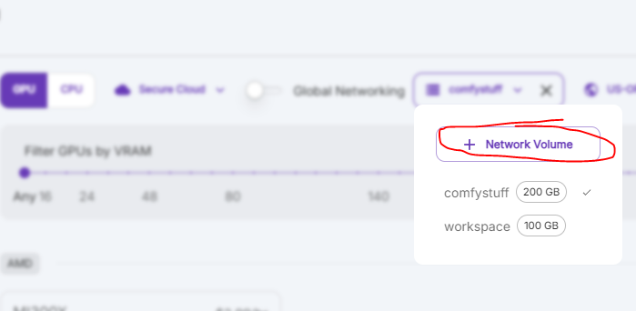

## Deploy on RunPod

### Create a Network Volume
1. Deploy a new RunPod server using the [livepeer-comfystream](https://runpod.io/console/deploy?template=w01m180vxx&ref=u8tlskew) template
2. Create and select a network volume to persist files

3. Select an appropriate GPU (ex: RTX 4090) and click **Deploy On-Demand**

<Note>
For faster deployment without data persistence, use the [livepeer-comfystream-novolume](https://runpod.io/console/deploy?template=j4p1g7t5vs&ref=u8tlskew) template instead.
</Note>

<Warning>
First-time deployment to a network volume takes approximately 20-45 minutes depending on pod performance. Future pod restarts will be faster.

Click the **Logs** button to monitor deployment progress.
</Warning>

## Access ComfyUI and ComfyStream

Once deployed:
1. Click **Connect** in your pod's dashboard

2. Access ComfyUI through **HTTP Service -> :8188**
3. Access ComfyStream by copying the URL from **HTTP Service -> :3000**

## Additional Resources

- [Setting up SSH access](/technical/reference/develop-runpod)
- [Tunneling with SSH](/technical/reference/tunneling-with-ssh)
- [Performance recommendations](/technical/reference/performance-recommendations)
